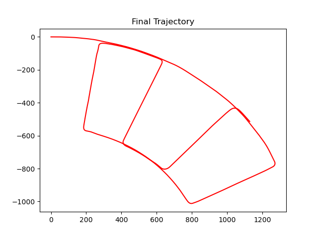
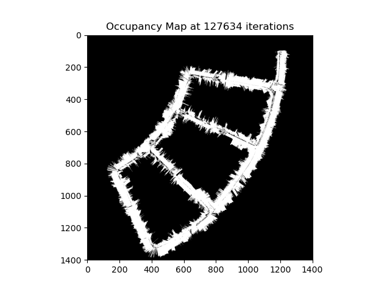

# Particle-Filter-SLAM
#SLAM with Particle Filter

###Overview
This project aims to perform SLAM using a Particle Filter. Given a car's encoder, Fiber Optic
Gyro (FOG) and lidar data, we can plot the trajectory of the car. 
The approach is using a particle filter which localises and maps the car using these two steps in a loop
1) **Prediction** - Using the encoder data and FOG data, the car's instantaneous 
linear and angular velocity is used in a differential drive motion model to get change in vahicle state.

2) **Update**
Using lidar scans, the particle weights are updated. They are then projected onto map after mapCorrelation
and bresenham2D rasterisation.

### How to run
The files need to be in the same directory structure as the PR2 zip folder.

### Data
The sensor and stereo data is provided in the following files
1. fog.csv
2. lidar.csv
3. encoder.csv
4. stereo_images

The params folder has the transformation and parameters of each sensor

### Files to run
1. `first_lidar.py` - This gives the projection of first lidar scan on map. The MAP parameters 
need to be changed to [-50,50] and resolution 0.1 to see the scan in the centre
2. `deadreckoning.py` - This gives the trajectory using only encoder and FOG readings of a single particle with no noise.
3. `main_slam.py` - This runs the SLAM algorithm in entirety. The various plots can be visualized by uncommenting lines of code

The other files are helper modules.

### Results

